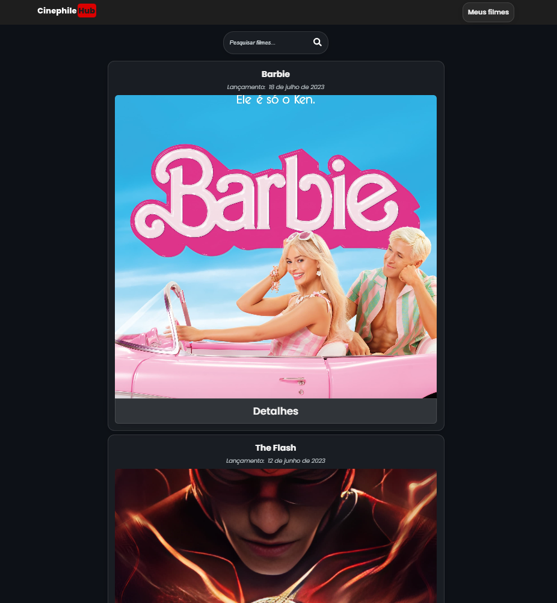
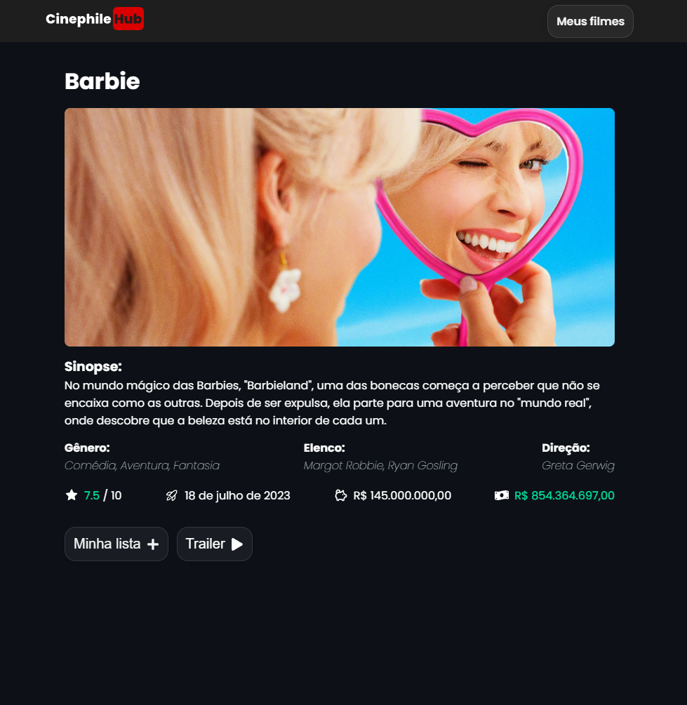
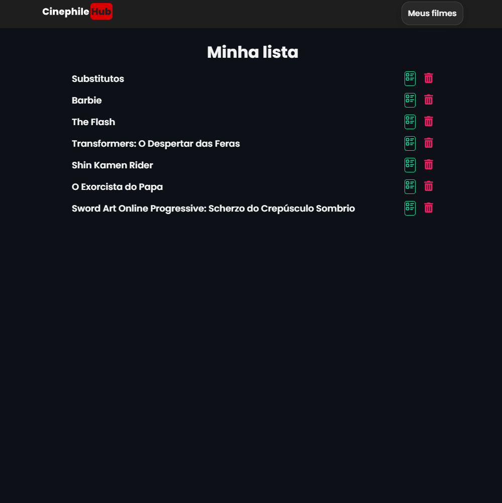

<div align="center">
<h1 align="center">🍿🎬Cinephilehub.<br> made with React and Vite. ⚛</h1>

</div>

&nbsp;

<p align="center">
  <a href="#Technologies">Technologies</a>&nbsp;&nbsp;&nbsp;|&nbsp;&nbsp;&nbsp;
  <a href="#Project">Project</a>&nbsp;&nbsp;&nbsp;|&nbsp;&nbsp;&nbsp;
  <a href="#License">License</a>
</p>

<p align="center">
 
  
  
</p>
&nbsp;
&nbsp;
&nbsp;



&nbsp;

## 📖 Sobre o projeto

O projeto **Cinephilehub** é uma aplicação web desenvolvida com React.js e Vite, que consome a API do [The Movie Database](https://www.themoviedb.org/) para exibir informações sobre filmes, séries e atores.

## 💻 Tecnologias utilizadas no projeto

- [React.js](https://reactjs.org) (v18)
- [Vite.js](https://vitejs.dev) (v3)
- [ESLint](https://eslint.org)
- [Prettier](https://prettier.io)
- [React Router Dom](https://reactrouter.com/en/main)

## 🌿 Branches

- `main` projeto finalizado.

## 🎨 Protótipo do projeto

## 📝 Licença

Este projeto está sob a licença MIT. Consulte a [LICENÇA](./LICENSE) para obter mais informações.


## 🗄️ Estrutura de pastas

O projeto está estruturado da seguinte forma:

- 📁 `public`
- 📁 `src`
  - 📁 `assets`
  - 📁 `pages`
    - 📁 `Home`
    - 📁 `Movie`
    - 📁 `Favorites`
    - 📁 `Error`
  - 📁 `components`
  - 📁 `Header`
  - 📁 `Loader`
  - ⚛️ `App.jsx`
  - ⚛️ `main.jsx`
  - ⚛️ `routes.jsx`

## 🛠️ Instruções de execução

Siga as instruções abaixo para rodar o projeto em seu ambiente local:


1. Certifique-se de ter o Node.js instalado em seu computador. Você pode baixar a versão mais recente do Node.js em https://nodejs.org.

2. Clone este repositório em seu computador ou faça o download do código fonte.

3. Abra o terminal e navegue até o diretório raiz do projeto.

4. Instale as dependências do projeto executando o seguinte comando:

```bash
  npm install
```

5. Após a conclusão da instalação das dependências, inicie o servidor de desenvolvimento local com o comando:

```bash
  npm run dev
```

6. O servidor local será iniciado e você poderá acessar o projeto no seu navegador através do seguinte endereço:

```bash
  http://localhost:5173
```

Caso a porta 5173 estiver em uso, automaticamente o Vite.js irá subir na próxima porta livre da máquina.

Se deseja alterar a porta padrão na qual a aplicação tentará subir, você pode modificar a porta no arquivo `vite.config.js`.

Agora você está pronto para explorar o projeto em seu ambiente local!

<hr>

# Feature: Detalhes

Esta página exibe os detalhes de um título específico, como Elenco, Direção, Orçamento, etc.



# Feature: Favoritos

Esta página exibe uma lista com os títulos favoritos do usuário.



<hr>

Feito com 💜 por [Jhonatan Oliveira](https://jhonatanoliveira.com).